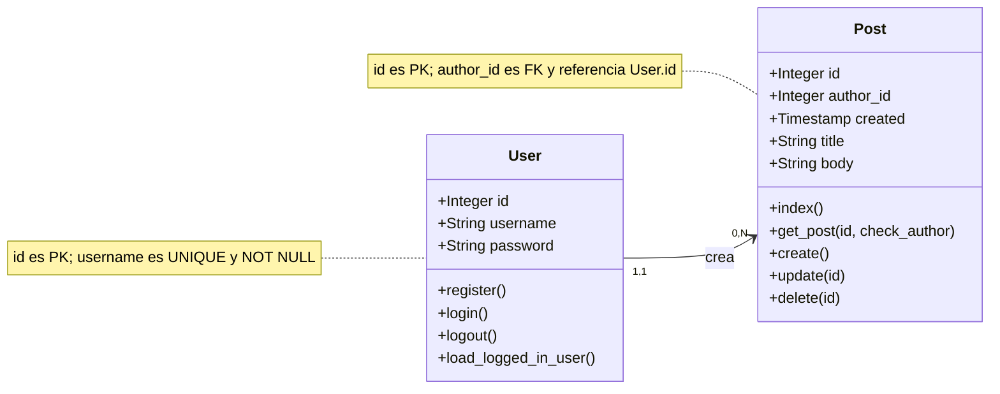

# Diagrama de clases

Este archivo contiene el diagrama UML del proyecto Flaskr. Representa las clases User y Post, sus atributos, funciones y la relación entre ellas.

```mermaid
classDiagram
    direction LR

    class User {
        +Integer id
        +String username
        +String password
        +register()
        +login()
        +logout()
        +load_logged_in_user()
    }

    class Post {
        +Integer id
        +Integer author_id
        +Timestamp created
        +String title
        +String body
        +index()
        +get_post(id, check_author)
        +create()
        +update(id)
        +delete(id)
    }

    User "1,1" --> "0,N" Post : crea

    note for User "id es PK; username es UNIQUE y NOT NULL"
    note for Post "id es PK; author_id es FK y referencia User.id"
```
